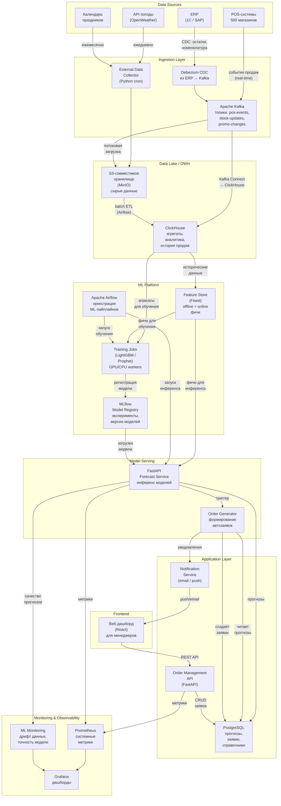

# Архитектура системы PrismFlow

## Диаграмма архитектуры

## Описание компонентов

### Data Sources (Источники данных)

- **POS-системы магазинов** — кассовое оборудование 500 магазинов генерирует события продаж в реальном времени. Каждая транзакция содержит SKU, количество, цену, время и идентификатор магазина. Суммарно ~7.3 млн транзакций в день.
- **ERP (1С / SAP)** — основная учётная система сети, содержит данные об остатках, номенклатуре, поставщиках, ценообразовании и промоакциях. Интеграция через CDC (Change Data Capture) для минимизации нагрузки на ERP.
- **API погоды** — внешний сервис, предоставляющий прогноз погоды по городам присутствия сети. Погода значимо влияет на спрос (мороженое, напитки, горячие блюда).
- **Календарь праздников** — справочник государственных и региональных праздников, школьных каникул, дней зарплат — факторов, создающих предсказуемые всплески спроса.

### Ingestion Layer (Слой приёма данных)

- **Apache Kafka** — распределённый брокер сообщений, обеспечивающий надёжный приём данных из POS-систем в реальном времени. Три основных топика: `pos-events` (продажи), `stock-updates` (изменения остатков), `promo-changes` (промоакции). Kafka выбран за гарантии доставки (at-least-once), горизонтальную масштабируемость и экосистему коннекторов.
- **Debezium CDC** — захват изменений из базы данных ERP без нагрузки на боевую систему. Транслирует INSERT/UPDATE/DELETE из ERP в топики Kafka.
- **External Data Collector** — Python-сервис, запускаемый по расписанию (cron), для сбора данных из внешних API (погода, календарь) и загрузки в S3.

### Data Lake / DWH (Хранилище данных)

- **S3-совместимое хранилище (MinIO)** — хранит сырые данные в формате Parquet, партиционированные по дате. Выполняет роль Data Lake: все данные сначала попадают сюда в исходном виде, обеспечивая возможность переобработки. MinIO — self-hosted альтернатива AWS S3, снижающая зависимость от облачного провайдера.
- **ClickHouse** — колоночная аналитическая СУБД для хранения агрегатов и выполнения аналитических запросов. Обрабатывает 2.67 млрд строк продаж со скоростью, недостижимой для PostgreSQL. Используется для подготовки данных для обучения моделей и построения аналитических дашбордов.

### ML Platform (ML-платформа)

- **Feature Store (Feast)** — централизованное хранилище ML-фичей. Обеспечивает консистентность между обучением (offline store в ClickHouse) и инференсом (online store в Redis). Предвычисленные фичи: скользящие средние, тренды, сезонные компоненты, лаговые переменные, промо-эффекты.
- **Apache Airflow** — оркестратор пайплайнов. Управляет DAG-ами: ежедневное обучение/переобучение моделей, вычисление фичей, запуск инференса, загрузка данных. Обеспечивает мониторинг, ретраи и алертинг при сбоях.
- **MLflow** — реестр моделей и трекинг экспериментов. Хранит версии моделей, метрики экспериментов, артефакты обучения. Позволяет откатиться к предыдущей версии модели при деградации качества.
- **Training Jobs** — вычислительные задачи обучения моделей. Основные алгоритмы: LightGBM (для табличных данных с фичами) и Prophet (для товаров с выраженной сезонностью). Обучение выполняется на CPU-воркерах (LightGBM не требует GPU).

### Model Serving (Обслуживание моделей)

- **FastAPI Forecast Service** — HTTP-сервис, выполняющий инференс модели. Загружает актуальную модель из MLflow, получает фичи из Feature Store, формирует прогнозы и сохраняет их в PostgreSQL. Работает в batch-режиме (ежедневно), но архитектура позволяет перейти к online-режиму при необходимости.
- **Order Generator** — сервис автоматического формирования заявок. Читает прогнозы из PostgreSQL, учитывает текущие остатки, минимальные партии поставки, сроки годности и формирует черновики заявок. Отправляет уведомления менеджерам через Notification Service.

### Application Layer (Прикладной слой)

- **PostgreSQL** — основная оперативная база данных. Хранит актуальные прогнозы, заявки, справочники магазинов и товаров. Обеспечивает ACID-транзакции для операций с заявками.
- **Order Management API** — REST API для веб-интерфейса. Предоставляет CRUD-операции для заявок, эндпоинты для просмотра прогнозов и аналитики. Реализован на FastAPI.
- **Notification Service** — сервис уведомлений. Отправляет push-уведомления и email менеджерам при формировании новых заявок, срочных корректировках или алертах системы.

### Frontend (Веб-интерфейс)

- **Веб-дашборд (React)** — SPA-приложение для менеджеров магазинов и категорийных менеджеров. Позволяет просматривать прогнозы, подтверждать/корректировать заявки, анализировать метрики качества модели и бизнес-показатели (списания, out-of-stock).

### Monitoring & Observability (Мониторинг)

- **Prometheus** — сбор системных метрик (CPU, RAM, латентность API, количество запросов) со всех сервисов.
- **Grafana** — визуализация метрик. Дашборды для DevOps (здоровье системы) и Data Science (качество модели).
- **ML Monitoring** — специализированный мониторинг ML-метрик: отслеживание дрифта данных, деградации точности модели, аномалий в прогнозах. При обнаружении деградации автоматически запускает переобучение.

### Обоснование распределённой архитектуры

Архитектура следует принципу разделения ответственности:

1. **Ingestion отделён от Storage** — Kafka выступает буфером между источниками и хранилищами, обеспечивая отказоустойчивость (если ClickHouse недоступен, данные не теряются) и возможность подключения новых консьюмеров без изменения источников.

2. **ML Platform отделена от Application Layer** — обучение моделей и инференс работают независимо от бизнес-логики заявок. Это позволяет обновлять модели без простоя бизнес-системы и масштабировать ML-вычисления отдельно от прикладной нагрузки.

3. **OLTP отделён от OLAP** — PostgreSQL обслуживает оперативные запросы (веб-интерфейс), ClickHouse — аналитические (подготовка данных, отчёты). Каждая СУБД оптимизирована для своего паттерна нагрузки.
