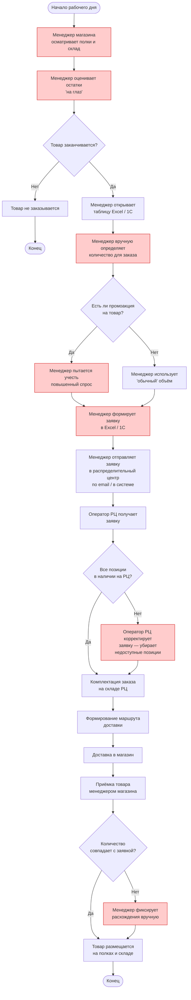

# BPMN AS-IS: Управление запасами (текущий процесс)

## Диаграмма процесса

## Описание процесса

### Общая характеристика

Текущий процесс управления запасами в сети супермаркетов полностью зависит от ручного труда менеджеров магазинов. Каждый менеджер самостоятельно оценивает остатки товаров, принимает решения о необходимых объёмах заказа и формирует заявки. Процесс не стандартизирован: разные менеджеры используют разные подходы к оценке, что приводит к значительной вариативности качества заказов между магазинами.

### Ключевые точки ошибок (выделены красным)

На диаграмме красным цветом выделены шаги, где наиболее часто возникают ошибки:

- **Оценка остатков «на глаз»** — менеджер может не заметить, что товар заканчивается, или, наоборот, переоценить потребность. Особенно критично для скоропортящихся товаров (молоко, хлеб, овощи), где ошибка приводит к прямым финансовым потерям от списаний.
- **Ручное определение количества** — менеджер опирается на интуицию и прошлый опыт, не учитывая сезонность, день недели, погоду и другие факторы, влияющие на спрос. При 10 000 уникальных SKU невозможно держать в голове паттерны продаж каждого товара.
- **Учёт промоакций** — менеджер может забыть о предстоящей акции или неверно оценить её влияние на спрос, что приводит к дефициту акционных товаров или избытку после окончания акции.
- **Формирование заявки вручную** — при заполнении таблиц возможны опечатки, пропуск позиций, дублирование. Проверка заявки перед отправкой также выполняется вручную.
- **Корректировка заявки на РЦ** — при отсутствии товара на распределительном центре оператор самостоятельно решает, чем заменить позицию или убирает её без согласования с магазином.
- **Фиксация расхождений** — расхождения между заявкой и фактической поставкой фиксируются вручную, что замедляет инвентаризацию и может приводить к ошибкам в учёте остатков.

### Последствия для бизнеса

При масштабе сети (500 магазинов, 10 000 SKU, 2.67 млрд продаж в год) ручной процесс приводит к системным потерям: по оценкам, 3–5% выручки теряется из-за out-of-stock (товар отсутствует на полке), а 2–4% — из-за списаний просроченных скоропортящихся товаров. Суммарно это составляет значительную долю маржинальности сети.
