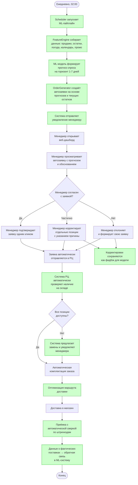

# BPMN TO-BE: Управление запасами (после внедрения ML)

## Диаграмма процесса

## Описание процесса

### Общая характеристика

В новом процессе ML-система берёт на себя аналитическую нагрузку: сбор данных, прогнозирование спроса и формирование оптимальных заявок. Менеджер магазина переходит из роли «аналитик + оператор» в роль «контролёр + эксперт», подтверждая или корректируя предложения системы. Это позволяет масштабировать качество принятия решений на все 500 магазинов одновременно.

### Что автоматизирует ML (выделено зелёным)

На диаграмме зелёным цветом выделены шаги, которые полностью или частично автоматизируются:

- **Запуск пайплайна по расписанию** — вместо ручного осмотра полок система автоматически запускается каждую ночь и обрабатывает данные всех 500 магазинов параллельно.
- **Сбор и подготовка данных** — система автоматически агрегирует данные из POS-систем, ERP, внешних API (погода, календарь праздников) и промоакций. Менеджеру не нужно искать информацию в разных источниках.
- **Прогнозирование спроса** — ML-модель учитывает десятки факторов (сезонность, день недели, погода, промоакции, тренды, каннибализация товаров), что невозможно при ручном анализе. Прогноз формируется на уровне товар × магазин × день.
- **Генерация автозаявок** — система рассчитывает оптимальный объём заказа с учётом прогноза, текущих остатков, сроков годности, минимальных партий поставки и логистических ограничений.
- **Обратная связь** — каждая корректировка менеджера и данные о фактических продажах автоматически поступают обратно в систему, улучшая качество будущих прогнозов.

### Ключевые изменения по сравнению с AS-IS

| Аспект | AS-IS | TO-BE |
|--------|-------|-------|
| Оценка остатков | Визуальный осмотр | Автоматический мониторинг через POS/ERP |
| Прогноз спроса | Интуиция менеджера | ML-модель с учётом 50+ факторов |
| Формирование заявки | Ручное заполнение Excel | Автогенерация с возможностью корректировки |
| Учёт промоакций | «Если вспомнит менеджер» | Автоматический учёт из системы промо |
| Время на заказ | 1–2 часа на магазин | 5–10 минут на проверку и подтверждение |
| Масштабируемость | Зависит от опыта менеджера | Единое качество на всю сеть |
| Обучение на ошибках | Нет системного механизма | Автоматический фидбэк-луп |

### Роль менеджера в новом процессе

Менеджер не исключается из процесса — он остаётся финальным звеном принятия решений. Система предоставляет ему прогноз с обоснованием (почему рекомендуется именно такое количество), и менеджер может скорректировать заявку на основе локальных знаний (например, ремонт дороги рядом с магазином, местное мероприятие). Каждая корректировка логируется и используется для улучшения модели.
