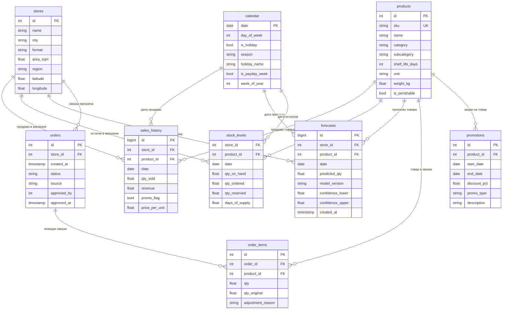

# Модель данных (ER-диаграмма)

## ER-диаграмма

## Описание модели данных

### Обоснование структуры

Модель данных спроектирована вокруг центральной бизнес-сущности — **продажи товара в конкретном магазине в конкретный день** (таблица `sales_history`). Эта гранулярность (товар × магазин × день) является базовой единицей для прогнозирования и позволяет строить модели на нужном уровне детализации. Все остальные сущности либо описывают измерения этого факта (`stores`, `products`, `calendar`), либо содержат связанные процессы (`orders`, `forecasts`, `stock_levels`, `promotions`).

Таблица `forecasts` зеркалит структуру `sales_history` по ключевым измерениям (store_id, product_id, date), что позволяет напрямую сравнивать прогноз с фактом для расчёта метрик качества модели. Поле `model_version` обеспечивает трассировку — всегда можно определить, какая версия модели сформировала конкретный прогноз.

Таблица `order_items` содержит как итоговое количество (`qty`), так и оригинальное предложение системы (`qty_original`) с причиной корректировки (`adjustment_reason`). Это создаёт фидбэк-луп: корректировки менеджеров используются как сигнал для улучшения модели.

### Распределение данных по хранилищам

Данные распределены по трём типам хранилищ в зависимости от паттернов доступа и требований к производительности:

#### PostgreSQL (OLTP) — оперативные данные

| Таблица | Обоснование |
|---------|------------|
| `stores` | Справочник, редко меняется, нужен для CRUD-операций в веб-интерфейсе |
| `products` | Справочник, обновляется при вводе новых SKU |
| `orders` | Транзакционные данные, требуют ACID-гарантий (создание, подтверждение, отмена) |
| `order_items` | Связаны с `orders`, участвуют в транзакциях |
| `forecasts` | Актуальные прогнозы (последние 7 дней), читаются веб-интерфейсом и OrderGenerator |
| `stock_levels` | Текущие остатки, обновляются в реальном времени из POS-систем |

PostgreSQL выбран для оперативного слоя благодаря поддержке транзакций (ACID), зрелой экосистеме и простоте эксплуатации командой из 3 человек.

#### ClickHouse (OLAP) — аналитика и история

| Данные | Обоснование |
|--------|------------|
| `sales_history` (полная история) | ~2.67 млрд строк в год, требуются агрегирующие запросы по срезам (магазин, категория, период). ClickHouse обеспечивает скорость аналитических запросов на порядки выше PostgreSQL |
| `forecasts` (архив) | Историческая точность моделей, ретроспективный анализ |
| `stock_levels` (история) | Анализ динамики остатков, выявление паттернов дефицита |
| `promotions` | Аналитика эффективности промоакций |
| `calendar` | Справочник дат, реплицируется из PostgreSQL |

ClickHouse выбран как колоночная СУБД, оптимизированная для аналитических запросов над большими объёмами данных. При 2.67 млрд продаж в год PostgreSQL не сможет обеспечить приемлемое время ответа на аналитические запросы.

#### Feature Store (Feast / собственная реализация) — ML-фичи

| Фичи | Обоснование |
|------|------------|
| Скользящие средние продаж (7, 14, 30, 90 дней) | Предвычисленные агрегаты для быстрого обучения и инференса |
| Тренды и сезонные компоненты | Декомпозиция временных рядов |
| Лаговые переменные | Продажи за предыдущие N дней |
| Промо-фичи | Текущие/будущие акции, исторический эффект акций |
| Внешние фичи | Погода, праздники, события |

Feature Store обеспечивает консистентность фичей между обучением (offline) и инференсом (online), предотвращая training-serving skew — одну из ключевых проблем ML-систем в production.

### Обоснование распределённого хранения

Распределение данных по нескольким хранилищам продиктовано тремя факторами:

1. **Масштаб данных**: 2.67 млрд транзакций в год невозможно эффективно хранить и анализировать в одной OLTP-базе. Разделение на оперативный (PostgreSQL) и аналитический (ClickHouse) слои — стандартный паттерн для таких объёмов.

2. **Различные паттерны доступа**: оперативные запросы (показать заявку менеджеру) требуют низкой латентности на единичных записях, а аналитические (средние продажи за квартал по категории) — быстрой агрегации миллиардов строк. Ни одна СУБД не оптимальна для обоих сценариев.

3. **ML-специфика**: Feature Store решает проблему feature consistency и позволяет переиспользовать фичи между разными моделями, а также обеспечивает point-in-time correctness при обучении (избегая data leakage).
