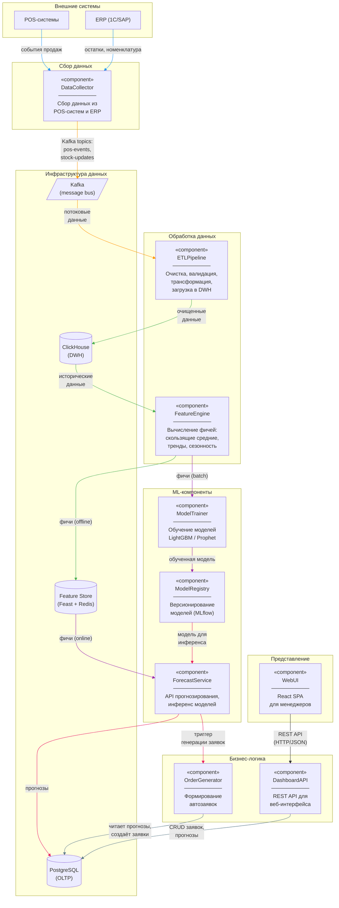

# UML-диаграмма компонентов

## Диаграмма

## Описание компонентов

### DataCollector (Сборщик данных)

**Ответственность:** Приём данных из внешних источников — POS-систем 500 магазинов и ERP-системы (1С/SAP). Трансляция событий в Kafka-топики для дальнейшей обработки.

**Интерфейсы:**
- Входящие: API POS-систем (REST/WebSocket), CDC-поток из ERP (Debezium)
- Исходящие: Kafka-топики `pos-events`, `stock-updates`, `promo-changes`

**Технологии:** Python, Debezium, Kafka Producer API

---

### ETLPipeline (Пайплайн обработки данных)

**Ответственность:** Чтение сырых данных из Kafka, очистка (дедупликация, обработка пропусков, валидация), трансформация (приведение типов, нормализация) и загрузка в DWH (ClickHouse).

**Интерфейсы:**
- Входящие: Kafka Consumer (топики `pos-events`, `stock-updates`)
- Исходящие: ClickHouse (INSERT батчами)

**Технологии:** Apache Airflow (оркестрация), Python, clickhouse-driver

---

### FeatureEngine (Движок фичей)

**Ответственность:** Вычисление ML-фичей из исторических данных. Фичи включают: скользящие средние продаж (7/14/30/90 дней), тренды, сезонные компоненты, лаговые переменные, промо-эффекты, погодные корреляции.

**Интерфейсы:**
- Входящие: ClickHouse (исторические данные)
- Исходящие: Feature Store / Feast (offline store — для обучения, online store — для инференса)

**Технологии:** Python, Feast SDK, pandas, NumPy

---

### ModelTrainer (Тренировщик моделей)

**Ответственность:** Обучение ML-моделей прогнозирования спроса. Поддерживает два алгоритма: LightGBM (основной, для табличных данных) и Prophet (для товаров с выраженной сезонностью). Выполняет кросс-валидацию, подбор гиперпараметров, оценку метрик.

**Интерфейсы:**
- Входящие: Feature Store (обучающая выборка), Airflow (триггер запуска)
- Исходящие: MLflow Model Registry (регистрация обученной модели)

**Технологии:** Python, LightGBM, Prophet, scikit-learn, MLflow SDK

---

### ModelRegistry (Реестр моделей)

**Ответственность:** Версионирование и хранение обученных моделей. Управление жизненным циклом модели (staging → production → archived). Хранение метрик экспериментов и артефактов.

**Интерфейсы:**
- Входящие: ModelTrainer (регистрация новой модели)
- Исходящие: ForecastService (загрузка production-модели)

**Технологии:** MLflow Model Registry, S3 (артефакты)

---

### ForecastService (Сервис прогнозирования)

**Ответственность:** Выполнение инференса — загрузка актуальной модели из ModelRegistry, получение фичей из Feature Store, формирование прогнозов для всех комбинаций товар × магазин на горизонт 1–7 дней.

**Интерфейсы:**
- Входящие: Airflow (триггер запуска), Feature Store (online-фичи), ModelRegistry (модель)
- Исходящие: PostgreSQL (сохранение прогнозов), OrderGenerator (триггер генерации заявок)
- API: `POST /predict`, `GET /forecast/{store_id}/{product_id}`

**Технологии:** FastAPI, Python, LightGBM/Prophet runtime, MLflow SDK

---

### OrderGenerator (Генератор заявок)

**Ответственность:** Автоматическое формирование заявок на поставку на основе прогнозов. Учитывает текущие остатки, минимальные партии поставки, сроки годности, график доставки. Создаёт черновики заявок со статусом `draft` для подтверждения менеджером.

**Интерфейсы:**
- Входящие: ForecastService (триггер), PostgreSQL (прогнозы, остатки)
- Исходящие: PostgreSQL (заявки), NotificationService (уведомления менеджерам)

**Технологии:** Python, FastAPI

---

### DashboardAPI (API дашборда)

**Ответственность:** REST API для веб-интерфейса. Предоставляет эндпоинты для просмотра прогнозов, управления заявками (просмотр, корректировка, подтверждение), просмотра аналитики и метрик качества модели.

**Интерфейсы:**
- Входящие: WebUI (HTTP REST)
- Исходящие: PostgreSQL (данные)
- API: `GET /orders`, `PUT /orders/{id}`, `GET /forecasts`, `GET /analytics`

**Технологии:** FastAPI, SQLAlchemy, Pydantic

---

### WebUI (Веб-интерфейс)

**Ответственность:** SPA-приложение для менеджеров магазинов и категорийных менеджеров. Отображает прогнозы, заявки, аналитику. Позволяет корректировать заявки с указанием причины.

**Интерфейсы:**
- Входящие: пользователь (браузер)
- Исходящие: DashboardAPI (REST API)

**Технологии:** React, TypeScript, Recharts (графики), Ant Design (UI-kit)

## Зависимости и потоки данных

Компоненты организованы в четыре слоя по направлению потока данных:

1. **Сбор данных** → 2. **Обработка данных** → 3. **ML-компоненты** → 4. **Бизнес-логика** → 5. **Представление**

Ключевые принципы:
- Каждый компонент имеет единственную ответственность (Single Responsibility)
- Взаимодействие между компонентами — через явные интерфейсы (REST API, Kafka topics, DB connections)
- Данные движутся в одном направлении (от источников к пользователю), обратная связь (корректировки менеджеров) замыкает цикл через базу данных
