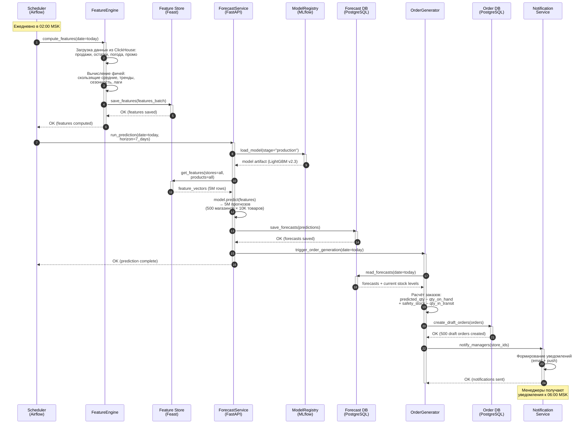
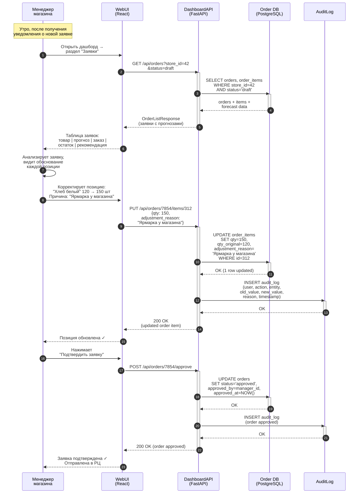

# UML-диаграммы последовательности

## 1. Процесс ежедневного формирования прогноза

### Диаграмма

### Описание процесса

Процесс ежедневного формирования прогноза запускается автоматически по расписанию (Airflow DAG) в 02:00 по московскому времени — в период минимальной нагрузки на системы.

**Этап 1: Вычисление фичей (шаги 1–5).** Scheduler запускает FeatureEngine, который загружает актуальные данные из ClickHouse (продажи за предыдущий день, текущие остатки, прогноз погоды, активные промоакции) и вычисляет ML-фичи: скользящие средние продаж за 7/14/30/90 дней, тренды, сезонные компоненты, лаговые переменные, промо-эффекты. Готовые фичи сохраняются в Feature Store (Feast) для обеспечения консистентности между обучением и инференсом.

**Этап 2: Инференс модели (шаги 6–11).** ForecastService загружает production-версию модели из MLflow Model Registry, получает фичи из Feature Store и выполняет предсказания для всех комбинаций товар × магазин × день на горизонт 7 дней. Это ~5 млн прогнозов (500 магазинов × 10 000 товаров). Результаты сохраняются в PostgreSQL.

**Этап 3: Генерация заявок (шаги 12–17).** OrderGenerator читает прогнозы и текущие остатки, рассчитывает оптимальный объём заказа по формуле: `заказ = прогноз − остаток + страховой запас − товар в пути`. Создаёт черновики заявок (статус `draft`) для каждого магазина и отправляет уведомления менеджерам. К 06:00 менеджеры получают готовые заявки для проверки.

---

## 2. Процесс корректировки заявки менеджером

### Диаграмма

### Описание процесса

Процесс корректировки заявки начинается утром, когда менеджер магазина получает push-уведомление о сформированной автозаявке.

**Этап 1: Просмотр заявки (шаги 1–6).** Менеджер открывает веб-дашборд и переходит в раздел «Заявки». Система отображает список черновиков заявок для его магазина. Каждая позиция содержит: название товара, прогноз спроса модели, рекомендуемое количество заказа, текущий остаток и обоснование (почему модель рекомендует именно такое количество — например, «промоакция с понедельника, ожидаемый рост +40%»).

**Этап 2: Корректировка (шаги 7–13).** Менеджер анализирует заявку и может скорректировать отдельные позиции. В примере менеджер увеличивает заказ хлеба со 120 до 150 штук, указывая причину — ярмарка рядом с магазином (локальное знание, недоступное модели). Система сохраняет как новое, так и оригинальное количество, а также причину корректировки. Все изменения логируются в AuditLog для последующего анализа и обучения модели.

**Этап 3: Подтверждение (шаги 14–19).** После проверки всех позиций менеджер подтверждает заявку. Статус меняется с `draft` на `approved`, фиксируется время и идентификатор менеджера. Подтверждённая заявка автоматически отправляется в распределительный центр для комплектации. Корректировки менеджеров агрегируются и используются как сигнал для улучшения модели — если менеджеры систематически корректируют прогноз в одну сторону, это указывает на систематическую ошибку модели.
