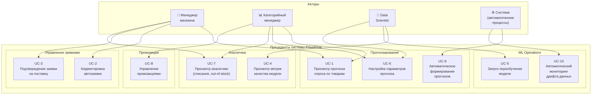

# UML-диаграмма прецедентов (Use Cases)

## Диаграмма

## Описание акторов

| Актор | Роль | Основные задачи |
|-------|------|-----------------|
| **Менеджер магазина** | Оперативное управление запасами в конкретном магазине | Просмотр прогнозов по своему магазину, проверка и подтверждение автозаявок, корректировка позиций на основе локальных знаний, анализ показателей эффективности |
| **Категорийный менеджер** | Управление товарными категориями на уровне всей сети (центральный офис) | Анализ прогнозов и продаж по категориям товаров, настройка параметров прогнозирования, управление промоакциями, стратегическая аналитика |
| **Data Scientist** | Разработка и поддержка ML-моделей | Мониторинг качества моделей, запуск переобучения, настройка гиперпараметров, анализ метрик и экспериментов |
| **Система** | Автоматические процессы без участия человека | Ежедневное формирование прогнозов по расписанию, мониторинг дрифта данных, автоматические алерты |

---

## Описание прецедентов

### UC-1: Просмотр прогноза спроса по товарам

**Акторы:** Менеджер магазина, Категорийный менеджер

**Описание:** Пользователь просматривает прогноз спроса на товары в разрезе магазина, категории, временного периода. Прогноз отображается с интервалом уверенности и визуализацией в виде графика — фактические продажи за прошлые периоды и прогнозные значения на горизонт 1–7 дней.

**Основной сценарий:**
1. Пользователь выбирает магазин (менеджер видит только свой, категорийный — все)
2. Пользователь фильтрует товары по категории/подкатегории
3. Система отображает таблицу с прогнозами и графики трендов
4. Пользователь может детализировать прогноз до уровня конкретного SKU

---

### UC-2: Корректировка автозаявки

**Акторы:** Менеджер магазина

**Описание:** Менеджер корректирует автоматически сформированную заявку — изменяет количество отдельных позиций или добавляет/удаляет товары. Каждая корректировка требует указания причины и сохраняется для обратной связи ML-модели.

**Основной сценарий:**
1. Менеджер открывает заявку со статусом `draft`
2. Менеджер видит обоснование каждой позиции (прогноз, остаток, рекомендация)
3. Менеджер изменяет количество и указывает причину
4. Система сохраняет корректировку, исходное значение и причину
5. Корректировка фиксируется в AuditLog

---

### UC-3: Подтверждение заявки на поставку

**Акторы:** Менеджер магазина

**Описание:** Менеджер подтверждает заявку (оригинальную или скорректированную), после чего она автоматически отправляется в распределительный центр для комплектации. Подтверждение необратимо — дальнейшие изменения возможны только через отмену и создание новой заявки.

**Основной сценарий:**
1. Менеджер проверяет итоговый состав заявки
2. Менеджер нажимает «Подтвердить»
3. Система меняет статус на `approved` и фиксирует время/автора
4. Заявка отправляется в систему РЦ

---

### UC-4: Просмотр метрик качества модели

**Акторы:** Data Scientist

**Описание:** Data Scientist просматривает актуальные метрики качества прогнозной модели: MAPE, WMAPE, MAE в разрезе категорий товаров, магазинов, временных периодов. Доступна визуализация динамики метрик и сравнение с предыдущими версиями модели.

**Основной сценарий:**
1. DS открывает дашборд метрик модели
2. Система отображает текущие значения MAPE/WMAPE/MAE
3. DS может фильтровать по категории, магазину, периоду
4. DS сравнивает метрики текущей и предыдущих версий модели

---

### UC-5: Запуск переобучения модели

**Акторы:** Data Scientist

**Описание:** Data Scientist вручную запускает переобучение модели с выбранными параметрами (алгоритм, гиперпараметры, обучающая выборка). Результат обучения регистрируется в Model Registry как новая версия. DS может промоутить модель в production после валидации.

**Основной сценарий:**
1. DS задаёт параметры обучения (алгоритм, гиперпараметры, период выборки)
2. DS запускает обучение (через UI или API)
3. Система выполняет обучение и кросс-валидацию
4. Результат регистрируется в MLflow с метриками
5. DS анализирует результат и принимает решение о промоушене в production

---

### UC-6: Настройка параметров прогноза

**Акторы:** Категорийный менеджер, Data Scientist

**Описание:** Пользователь настраивает параметры прогнозирования: горизонт прогноза (1–14 дней), гранулярность (день/неделя), уровень страхового запаса по категориям, минимальные партии заказа. Настройки влияют на генерацию автозаявок.

**Основной сценарий:**
1. Пользователь выбирает область настройки (категория, магазин, вся сеть)
2. Пользователь задаёт параметры (горизонт, гранулярность, safety stock)
3. Система валидирует параметры и применяет
4. Изменения вступают в силу со следующего цикла прогнозирования

---

### UC-7: Просмотр аналитики (списания, out-of-stock, точность)

**Акторы:** Менеджер магазина, Категорийный менеджер

**Описание:** Пользователь просматривает бизнес-метрики: процент списаний (скоропортящиеся товары), процент out-of-stock (упущенные продажи), точность прогнозов за период. Доступна фильтрация по магазину, категории, периоду и сравнение «до/после» внедрения ML.

**Основной сценарий:**
1. Пользователь выбирает период и область анализа
2. Система отображает KPI: % списаний, % OOS, WMAPE
3. Пользователь может детализировать до категории/SKU
4. Доступно сравнение с предыдущими периодами и целевыми показателями

---

### UC-8: Управление промоакциями (влияние на прогноз)

**Акторы:** Категорийный менеджер

**Описание:** Категорийный менеджер создаёт/редактирует промоакции (товар, период, скидка, тип акции). Система автоматически учитывает промоакции при формировании прогнозов — повышает прогнозируемый спрос на основе исторического эффекта аналогичных акций.

**Основной сценарий:**
1. Менеджер создаёт промоакцию (товар, даты, скидка)
2. Система оценивает ожидаемый прирост спроса на основе истории
3. Прогнозы автоматически корректируются на период акции
4. После окончания акции — фактический эффект сохраняется для обучения модели

---

### UC-9: Автоматическое формирование прогнозов

**Акторы:** Система

**Описание:** Система ежедневно в 02:00 MSK автоматически запускает полный цикл: вычисление фичей, инференс модели, формирование прогнозов и генерация черновиков заявок. Процесс полностью автоматизирован, без участия человека. При сбое — автоматический ретрай и алерт дежурному.

---

### UC-10: Автоматический мониторинг дрифта данных

**Акторы:** Система

**Описание:** Система непрерывно отслеживает статистические характеристики входных данных и прогнозов. При обнаружении дрифта (значимое отклонение распределения данных от обучающей выборки) — автоматический алерт Data Scientist с рекомендацией переобучить модель. При критическом дрифте — автоматический запуск переобучения.
